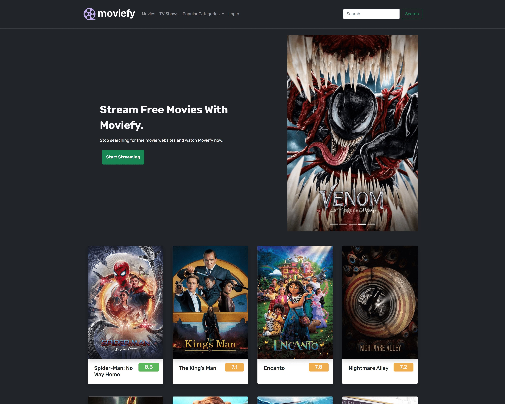

# moviefy

This is a front end web development project which integrates the external [TMDB API](https://developers.themoviedb.org/3).

## Table of contents

- [moviefy](#moviefy)
  - [Table of contents](#table-of-contents)
  - [Overview](#overview)
    - [The challenge](#the-challenge)
    - [Desktop Screenshot](#desktop-screenshot)
    - [Mobile Screenshot](#mobile-screenshot)
    - [Links](#links)
  - [My process](#my-process)
    - [Built with](#built-with)
    - [What I learned](#what-i-learned)
    - [Useful resources](#useful-resources)
  - [Contact me](#contact-me)

## Overview
This project uses HTML,CSS and JavaScript. For simplicity of design I have used Bootstrap and Bootstrap icons. I have used the free TMDB API as mentioned before,
### The challenge

Users should be able to:

- View the optimal layout depending on their device's screen size
- The movies should be fetched from the api and displayed in a nice layout which is easily accessible.
- The search functionality should allow users to search their favourite movies.
### Desktop Screenshot


### Mobile Screenshot
  


### Links

- Original Github Repo: [https://github.com/vimalkmr816/js-projects-intermediate](https://github.com/vimalkmr816/js-projects-intermediate)
- Live Site URL: [https://vimalkmr816.github.io/movie-app/](https://vimalkmr816.github.io/movie-app/)

## My process

### Built with

- Semantic HTML5 markup
- Flexbox
- Bootstrap Components
- Bootstrap Icons
- JavaScript 
- Mobile-first workflow


### What I learned

I learned a lot of new JavaScript concepts such as bubbling and adding event listeners on parent containers to catch clicks. 
I also learned about async behaviour of js and how to tackle those issues. 
Learned about ```fetch``` api and how to resolve error on my own
```js
//fetch api integration
  fetch(url)
        .then((res) => res.json())
        .then((data) => {
            showMovies(data.results);
            movieContainer.addEventListener("click", (e) => {
                const cardDiv = e.target.closest("article");
                showDetails(data.results, cardDiv);
            });
        })
        .catch((e) => {
            console.log("Error", e);
        });
```
```js
//api integration
const API_KEY = "api_key=07865664a1fb593da23026e2f6ccb3a1";
const BASE_URL = "https://api.themoviedb.org/3";
const API_URL = BASE_URL + "/discover/movie?sort_by=popularity.desc&" + API_KEY;
```
```js
//search functionality
    if (searchTerm) getMovies(SEARCH_URL + "&query=" + searchTerm);
    else getMovies(API_URL);
```
```js
//bubbling and capturing
const cardDiv = e.target.closest("article"); 
```
### Useful resources

- Learn JS From : [dcode](https://www.youtube.com/c/dcode-software)
- API Integration : [Asish George Tech](https://www.youtube.com/watch?v=9Bvt6BFf6_U)
- CSS : [Web Dev Simplified ](https://www.youtube.com/c/WebDevSimplified)
## Contact me

- Website - [Vimal ](https://github.com/vimalkmr816)
- Frontend Mentor - [@yourusername](https://www.frontendmentor.io/profile/yourusername)
- Twitter - [@vimalkmr816](https://twitter.com/vimalkmr816)
